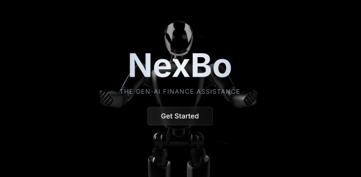
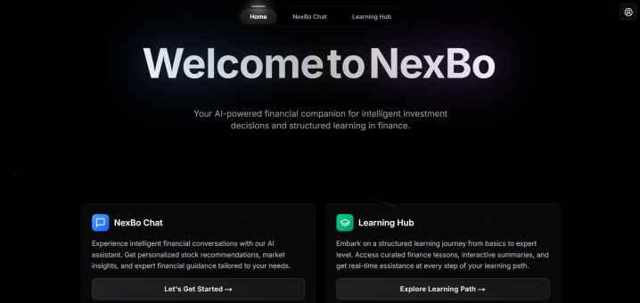
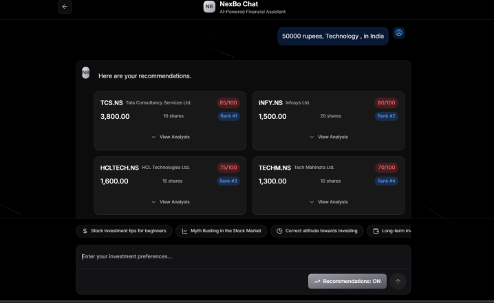
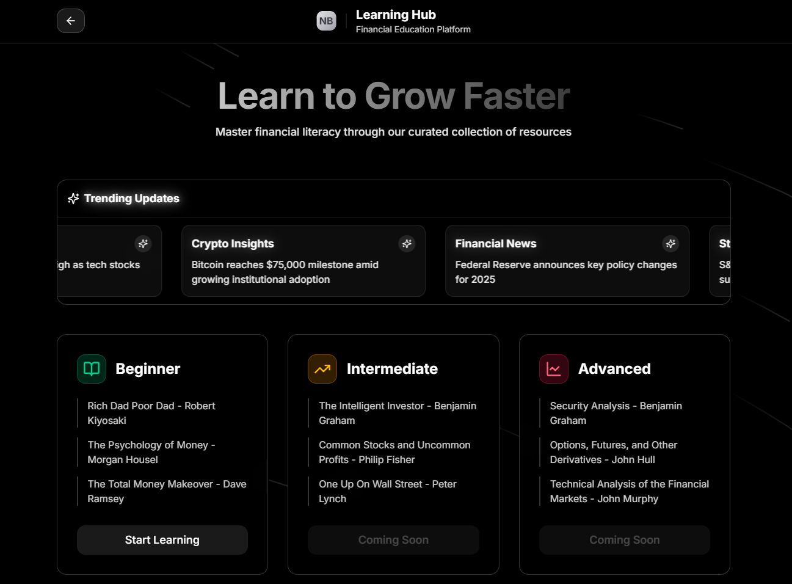
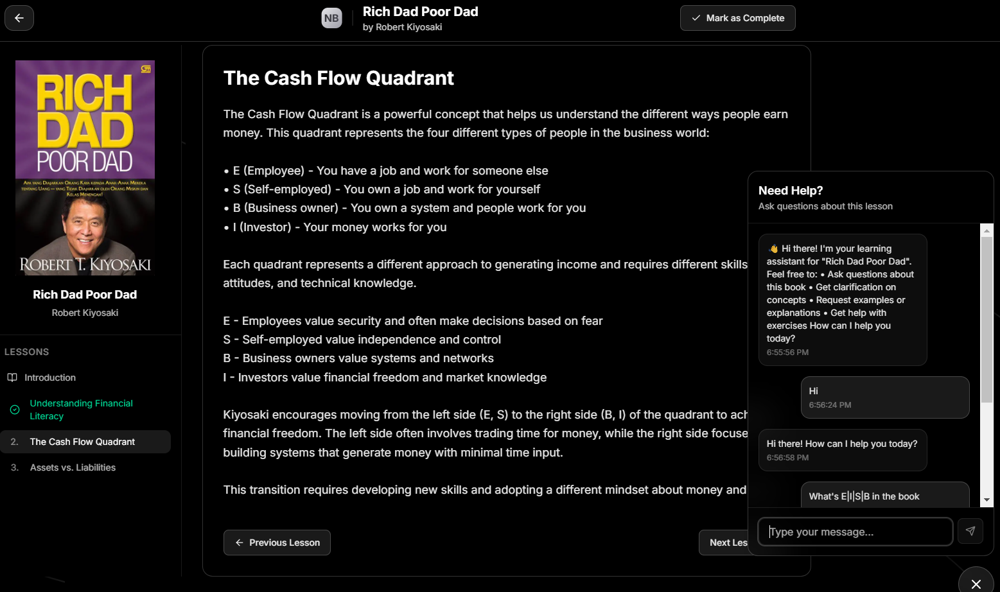

# NexBo - Your AI Financial Companion

NexBo is an intelligent financial assistant powered by generative AI that helps both beginners and experienced investors make better financial decisions. The platform combines personalized investment guidance with structured learning resources to create a comprehensive financial education experience.


## ✨ What is NexBo?

NexBo bridges the gap between financial education and practical investment advice.It helps make better investment decisions and know insights about investing. Using advanced AI, it provides:

- **Personalized financial guidance** tailored to your goals and risk tolerance
- **Stock recommendations** based on your budget and preferences
- **Structured learning resources** that take you from basic concepts to advanced strategies

## 🚀 Key Features

- ### NexBo Chat
An AI-powered chat interface that answers financial questions, provides investment advice, and offers stock recommendations. Simply toggle "Recommendations Mode" to get personalized stock picks based on your budget and preferences. It gives comprehensive recommendation report when asked for it.

- ### Learning Hub
A structured educational platform featuring:
- **Beginner, intermediate, and advanced levels**
- **Key financial book summaries** with interactive lessons and quizzes
- **Book.ai** - is a BookRAG that lets you ask questions about the concepts as you learn

## 🛠️ Technology Stack

### Frontend
- **Next.js 15** with React 19 for the UI
- **TypeScript** for type safety
- **Tailwind CSS** for styling
- **Firebase** for authentication
- **Framer Motion** for animations

### Backend
- **Python FastAPI** for the API server
- **LangGraph** for orchestrating the AI workflow
- **Gemini 2.0** from Google for the large language model
- **FAISS** for efficient vector search in book content
- **Sentence Transformers** for text embeddings

## 👥 Team

NexBo was developed by:
- **SEETHA NEERAJ KUMAR**
- **SURYA BODHI SATHWA**

## 🚀 Getting Started

### Prerequisites
- Node.js 18+ and npm/yarn/pnpm
- Python 3.12.2
- Google Gemini API key

### Backend Setup

1. Navigate to the backend directory:
   ```bash
   cd NexBo-Backend
   ```

2. Create a virtual environment:
   ```bash
   python -m venv venv
   source venv/bin/activate  # On Windows: .venv\Scripts\activate
   ```

3. Install dependencies:
   ```bash
   pip install -r requirements.txt
   ```

4. Create a `.env` file with your API keys:
   ```
   GOOGLE_API_KEY= your_gemini_api_key
   ```

5. Run the backend server:
   ```bash
   python main.py
   ```
   The server will start on http://localhost:5500

### Frontend Setup

1. Navigate to the frontend directory:
   ```bash
   cd NexBo_FE
   ```

2. Install dependencies:
   ```bash
   npm install
   # or
   yarn install
   ```

3. Run the development server:
   ```bash
   npm run dev
   # or
   yarn dev
   ```
   The frontend will be available at http://localhost:3000

## 📁 Project Structure

```
NexBo_GDG_SG/
├── NexBo-Backend/            # Python backend
│   ├── main.py               # Main FastAPI server
│   ├── chatbot.py            # Chat functionality
│   ├── BookAgent.py          # Book-specific AI agent
│   ├── tools/                # AI tools for finance
│   ├── utils/                # Utility functions
│   └── prompts/              # System prompts
│
└── NexBo_FE/                 # Next.js frontend
    ├── src/
    │   ├── app/              # Next.js app router
    │   │   ├── home/         # Home page
    │   │   ├── learn/        # Learning hub
    │   │   ├── chat/         # Chat interface
    │   │   └── auth/         # Authentication
    │   ├── components/       # UI components
    │   ├── lib/              # Utility functions
    │   ├── data/             # Data files for books
    │   └── context/          # React context providers
    └── public/               # Static assets
```

## 📝 Environment Variables

### Frontend
The Firebase configuration is already set in `src/lib/firebase.ts`

### Backend
Required environment variables in `.env`:
- `GOOGLE_API_KEY` - Google Gemini API key

## Gallery









## 🔗 Links
- [Youtube Demo](https://youtu.be/GHgMH8V96FI)
- [MVP Live](https://nexbo-front.vercel.app)
